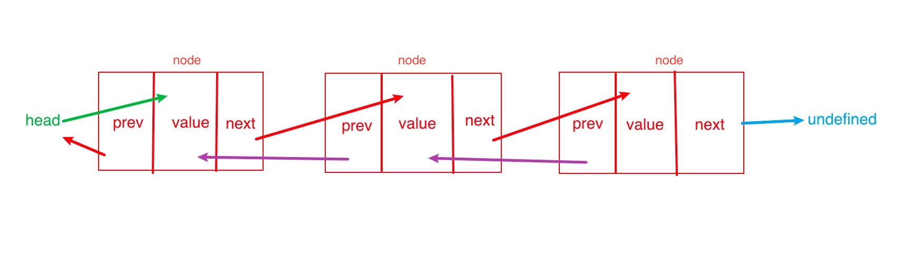

# 链表

> 存储有序元素集合，但不同于数组，链表中的元素在内存中并不是连续放置的。每个元素由一个 `存储元素本身的节点和一个指向下一个元素的引用组成`

## 链表相比于数组的优劣

- 添加或者移除元素的时候不需要移动其他元素

- 在数组中可以直接访问任何位置的任何元素，而想要访问链表中间的一个元素，则需要从起点开始迭代链表直到找到所需的元素

## 双向链表

> 双向链表和普通链表的区别在于，在普通链表中，一个节点只有链向下一个节点的链接；而在双向链表中，链接是双向的；一个链向下一个元素，另一个链向前一个元素

- 每次插入或者删除都需要处理4个引用，而不是2个，比较麻烦

- 相比于单向链表，占用的内存更大

## 循环链表

> 循环链表可以像链表一样只有单向引用，也可以像双向链表一样有双向引用。**循环链表和链表之间唯一的区别在于，最后一个元素指向下一个元素的指针（`tail.next`）不是引用 `undefined`，而是指向第一个元素（`head`）**

> 双向循环链表有指向 head 元素的 tail.next 和指向 tail 元素的 head.prev