# 集合

> 集合是由一组无序且唯一（即不能重复）的项组成的

- 创建集合

- 集合的运算

  - 并集：对于给定的两个集合，返回一个包含这俩集合中所有元素的新集合

  

  - 交集：对于给定的两个集合，返回一个包含这俩集合中共有元素的新集合

  

  - 差集：对于给定的两个集合，返回所有存在于第一个集合且不存在于第二个集合的元素的新集合

  

  - 子集：验证一个给定集合是否是另一个集合的子集

  

## ES2015 Set类