# 冒泡排序

> `冒泡排序` 比较所有相邻的两个项，如果第一个项比第二个项大，则交换它们。元素项向上移动至正确大顺序



- 循环排序

  - 每次循环，都会将最大都值放置至最后一位

  - 使用循环嵌套，内循环每次循环之后都会将最大值放置于末尾；所以应该降低内循环的循环项，因为数组末尾已经完成了排序（`由于外循环步骤 + 1；内循环需要全部循环一次；而已经排序好的项为外循环的次数。所以内循环的项数应该减去外循环已循环的次数`）

  - 内循环需要交换数组相邻位置的值，所以内循环的最大项为 `length - 1`；优化后内循环每次循环的最大长度为 `length - 1 - 外循环已循环的次数`
  ```js
    for (let i = 0, len = arr.length; i < arr; i++) {
      for (let j = 0; j < len - 1 - i; j ++) {
        // 比较 arr[j] 和 arr[j + 1]的大小确定是否需要交换位置
      }
    }
  ```
- 计算复杂度

  - N项的冒泡排序需要计算的次数为 `(N - 1) + (N - 2) + ... + 1 = N * (N - 1) / 2` ；所以为O(N^2)