# 插入排序

> `插入排序` 每次排一个数组项，依次方式构建最后的排序数组。（`算法的核心是局部有序`）



- 循环排序

  - 从`第一个元素`开始，可以认为该元素已经`有序`；（所以从索引1的位置开始开始）

  - 取出`下一个元素`，在已经排序的元素中`从后向前`扫描遍历

  - 如果`该元素（局部有序的元素中）大于新元素`，将该元素移到下一位置；依次重复执行，直到找到`已排序的元素小于或者等于新元素`的位置

  - 将新元素插入到该位置后，重复上面的步骤
  ``` js
    const len = array.length
    // 中间变量用来存储当前值
    let temp  
    for (let i = 1; i < len; i++) {
      temp = array[i]
      let j = i
      // array[j - 1] > temp  在已经排序好的元素中从 后 向前扫描
      while(j > 0 && array[j - 1] > temp) {
        // 已排序好的元素从后向前扫描中，如果前一项大于需要插入的项的值，将前一项赋值给当前项，然后索引减1后继续查找，直至索引为 0 或者 找到不大于 当前插入项的值
        array[j] = array[j - 1]
        j--
      }
      // 将当前插入项赋值给找到的索引位置；该位置的值已经赋值给了它后面的一项
      array[j] = temp
    }

  ```

- 计算复杂度

  - 排序小型数组时，此算法比选择排序和冒泡排序性能要好

  - 最多需要计算 `1 + 2 + 3 + ... + (N - 1) = N * (N - 1) / 2`次