# 选择排序

> `选择排序`算法是一种原址比较排序算法。选择排序大致的思路是找到数据结构中最小值并将其放置在第一位，接着找到第二小的值并将其放置在第二位，以此类推



- 循环排序

  - 每次循环都将最小值放置于数组的第一位

  - 内循环每次都从外循环的索引位置开始，并将开始位置假设为最小值，遍历剩余的数组项，找出最小值的索引，内循环结束之后交换最小索引的值和外循环当前索引位置的值

  ```js
    let minIndex
    // 最多需要比较数组的最后两项，所以外循环跳出条件为 arr.length - 1
    for (let i = 0; i < arr.length - 1; i++) {
      minIndex = i
      // minIndex 最大为 length - 2; 需要与数组最后一项 length - 1 比较；所以内循环 跳出条件为 arr.length
      for (let j = i; j < arr.length; j++) {
        if (arr[minIndex] > arr[j]){
          minIndex = j
        }
      }
      if (minIndex !== i) {
        // 交换位置，将 minIndex 对应的值放置于 i 的位置
      }
    }

  ```

- 计算复杂度

  - `O(N^2)`
