# 树

> 树结构数据是一种分层数据的抽象模型

> 一个树结构包含一系列存在父子关系的节点。每个节点都有一个父节点（除了顶部的根节点 root）以及零个或多个子节点

> 位于树顶部的节点叫`根节点`；树中的每个元素都叫节点。至少有一个子节点的节点称为`内部节点`；没有子元素的节点称为`外部节点`或`叶节点`

## 二叉树和二叉搜索树

- 二叉树

  - `二叉树`中的节点最多只能有两个子节点：一个是左侧子节点，另一个是右侧子节点。（`这个定义可以写出更高效地在树中插入、查找和删除节点的算法`）

- 二叉搜索树

  - `二叉搜索树(BST)`（**`Binary Search Tree`**）是二叉树的一种，但是`只允许在左侧子节点存储比父节点小的值，在右侧子节点存储比父节点大的值`

  

  > 插入元素

  

- 遍历二叉搜索树

  - 中序遍历

    `中序遍历`是一种以上行顺序访问 `BST` 所有节点的遍历方式，也就是以从最小到最大的顺序访问所有节点。（`中序遍历的一种应用就是对树进行排序操作`）

  - 先序遍历

    `先序遍历`是以优先于后代节点的顺序访问每个节点的。（`先序遍历的一种应用是打印一个结构化文档`）

  - 后序遍历

    `后序遍历`是先访问节点的后代节点，再访问节点本身。（`后序遍历的一种应用是计算一个目录及其子目录中所有文件所占空间的大小`）

- 搜索树中的值

  - 搜索最大值

  - 搜索最小值

  - 搜索特定值

  